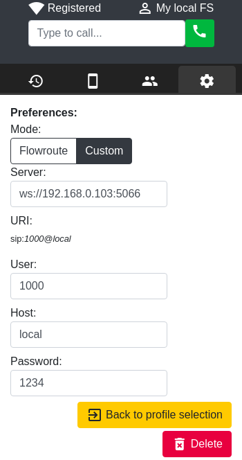

# Lhama Phone

Softphone for llamas.

> Deployed demo: https://lhama-phone.herokuapp.com/

## Setting up for development mode

This project was bootstrapped with [Create React App](https://github.com/facebook/create-react-app).
You'll need Node +10 (hint: use [nvm](https://github.com/nvm-sh/nvm))
and had used `npm install` in this project directory once. A few scripts will be available.

### Using on browser

Runs the app in the development mode and opens [http://localhost:3000](http://localhost:3000) on Chrome:

```sh
npm run start:web
```

Note that only Chrome is really supported, because the app main goal is to run as an Electron desktop app.
But you probably won't face much issues on Firefox or other browser that decently implemented WebRTC API.

### And as a desktop app

Instead of doing the above, just start the web server using this terminal command:

```sh
npm run start:no-browser
```

Once the output says that you can view the page, go to another terminal tab/window/pane and run:

```sh
npm run electron
```

You can still also open [http://localhost:3000](http://localhost:3000) to view it in the browser.

### Setting up a local hosted telephony platform

When you first open the app, there'll be a *Default* profile with some telephony settings and an existing
contact for [Flowroute](https://www.flowroute.com/) demo number.

But... if you know what you're doing (or it's curious enough to try anything) (and it's not using a MacOS),
you can have yourself a dockerized [FreeSWITCH](https://freeswitch.com/):

```sh
docker-compose up -d freeswitch
```

And just use the container's running FS to discover your settings data:

```sh
docker-compose exec freeswitch sh
fs_cli
sofia status profile internal
```

Considering that the app is served by `npm run start:web` or `start:no-browser` (which is using `http` and
not `https`), the important data here is the IP and port found in `WS-BIND-URL` data (and do not
mistake with `WSS-BIND-URL` which is for access with SSL).
For example, mine is currently `192.168.0.103:5066` (yours will be similar,
likely with the same port but with different IP), so my **server** is `ws://192.168.0.103:5066` and I
can put it in Lhama Phone's **Custom** settings mode. By default, **user** can be anything
from _1000_ to _1019_, the **host** is not important here and the **password** is _1234_. Pick two
different users with these settings (if you're running in the browser, the second one should be in a
Incognito window), then both Lhama Phones can call each other.

While making calls with yourself, take care with a possible whistling deafening sound!



### Running tests

There's a `npm test` tbat launches the test runner in the interactive watch mode, but they aren't implemented yet.

See the CRA's section about [running tests](https://facebook.github.io/create-react-app/docs/running-tests)
for more information and open an issue if you'd like to implement them.
